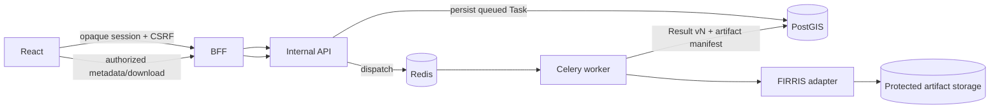

# FIRRIS End-User Product Lifecycle

## Scope

FIRRIS is the reference implementation of NOVA's engine-neutral execution and result-delivery contract. MEGIS and WRAS remain registered platform concepts only; this work does not implement their scientific processing.

## Supported FIRRIS products

The common lifecycle supports Flood Extent, Flood Depth, Flood Velocity, Flood Hazard, Flood Probability, Flood Duration, Flood Exposure, Flood Vulnerability, Flood Risk, Flood Susceptibility, and Flood Hazard Zonation.

## Delivery truth table

| Representation | Contract | Current FIRRIS analysis delivery | Viewer behavior |
|---|---|---|---|
| Metadata JSON | Available | Produced for each selected product | Metadata and AOI context displayed |
| Preview PNG | Available | Produced for 2D satellite-workflow products and screening atlases | Displayed through protected delivery |
| Raster GeoTIFF | Available | Produced for 2D satellite-workflow products | Protected download |
| Cloud Optimized GeoTIFF | Available | Produced and tiled with the GDAL COG driver | Protected download; browser tile querying remains future work |
| Vector GeoJSON | Available for Flood Extent | Vectorized flooded-cell polygons | Protected download; advanced vector rendering remains future work |

Every delivered artifact exposes an artifact type, media type, format, schema version, result version, byte size, SHA-256 checksum, and a protected same-origin URL. Server filesystem paths are not serialized.

Logical result layers expose CRS, bounding box, spatial resolution where supplied, units, nodata, legend metadata, available and planned delivery types, and an explicit `renderable` flag with a reason when rendering is unavailable.

## Result versioning

`Result` remains the persistent analysis-output record. A new execution increments the version for the same organization project, AOI, engine, and result type. Artifact manifests and generated reports carry that result version. No parallel persistence system or database migration was introduced.

## Reports and exports

Each successful FIRRIS execution now creates:

- `analysis-summary.json` — task/project/AOI/engine identity and result summary;
- `result-metadata.json` — GIS metadata plus delivered artifact metadata;
- `provenance.json` — producer and engine processing lineage;
- `firris-result-package.zip` — the reports above plus every delivered product artifact.

Satellite-workflow runs additionally create PDF, Excel, sample CSV, model/quality/
validation metadata, validation rasters, and the GIS representations listed above.

All exports use the same protected endpoint and organization/engine authorization checks as product downloads. ZIP contents are generated by the worker from the current result only.

## Frontend behavior

- The AOI page renders a lightweight SVG boundary preview in the declared CRS.
- Analysis history combines task lifecycle state with completed versioned results.
- Result detail provides logical layer selection, AOI context, CRS/bounds/readiness metadata, artifact integrity metadata, protected product downloads, and report-package exports.
- Metadata-only direct-calculation layers explicitly say that no georeferenced raster, vector, or preview was delivered.
- The frontend decodes protected COG/GeoTIFF products, renders protected Flood Extent GeoJSON, overlays the AOI with explicit CRS handling, and supports two-product comparison. Pixel querying and vector editing are not claimed.

## Security boundary

The BFF session, CSRF policy, NOVA database membership, engine entitlement, organization isolation, and internal-secret boundary are unchanged. Artifact downloads revalidate membership, project ownership, and engine entitlement on every request. Provider groups, roles, domains, and tenant claims do not grant engine access.
