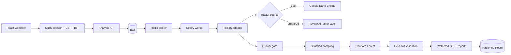

# FIRRIS Universal Satellite Image Analysis Workflow

## Scope and execution boundary

FIRRIS remains the only implemented NOVA analysis engine. MEGIS and WRAS keep their
registry entries but have no adapters or scientific implementations. The satellite
workflow runs through the existing browser-safe lifecycle:

The API operation remains `flood_mapping`. A typed optional `parameters.workflow`
selects the satellite path; requests without it continue to use the existing direct
product calculations. No separate FIRRIS-only task or result API was introduced.

## Data acquisition and preprocessing

The GEE provider accepts only a reviewed allow-list of datasets. Its baseline stack
requires Sentinel-1 GRD, Sentinel-2 SR Harmonized, CHIRPS Daily, SRTM or ALOS DEM,
and JRC Global Surface Water. Arbitrary Earth Engine asset IDs are rejected.

GEE execution performs:

- exact target and baseline date filtering;
- AOI filtering and final clipping to the persisted NOVA AOI;
- Sentinel-2 SCL cloud, cirrus, and shadow masking;
- Sentinel-1 focal-median speckle filtering;
- NDVI, MNDWI, NDBI, SAR change, elevation, slope, and rainfall features;
- reprojection to the configured EPSG CRS and scale;
- scene-count and valid-pixel-coverage quality gates.

The synchronous GEE download boundary is capped at 512 MiB. Larger AOIs must be
partitioned or moved to a future batch/object-storage export implementation; the
worker fails explicitly rather than returning a partial raster.

The current GEE baseline derives its training label from the existing SAR screening
mask. It is a **pseudo-label, not independent ground truth**. Provenance, UI copy, and
reports state this limitation. Authoritative validation requires reviewed observed
labels through the prepared-raster provider.

## Sampling, model, and validation

- Strategy: proportional stratified random sampling.
- Default sample size: 5,000, capped by available valid pixels.
- Minimum per class: 30.
- Default split: 70% training / 30% testing.
- Baseline: `RandomForestClassifier`, 200 estimators, deterministic seed 12345.
- Metadata: model key/version, library, feature names/importances, estimator count,
  seed, sample counts, and decision threshold.
- Validation: confusion counts, overall accuracy, precision, recall, specificity,
  F1, omission/commission error, Cohen's kappa, balanced accuracy, MCC, error rate,
  prevalence, ROC-AUC, plus confusion and agreement rasters.

Sample coordinates, observed label, split assignment, and extracted features are
exported as CSV and included in the Excel workbook and report package.

## Delivered artifacts

When a satellite workflow produces a two-dimensional FIRRIS product, the result
contains actual, checksum-addressed files:

- metadata JSON;
- GeoTIFF;
- Cloud Optimized GeoTIFF, written with the GDAL COG driver and checked for tiling;
- PNG preview;
- GeoJSON flood polygons for Flood Extent;
- validation GeoTIFFs;
- PDF analysis report;
- Excel workbook;
- sample CSV;
- quality, model, validation, provenance, and result metadata JSON;
- a ZIP package containing the delivered products and reports.

Filesystem paths never enter the browser contract. Every file is retrieved through
the protected Result product endpoint, which revalidates organization membership,
project ownership, and FIRRIS entitlement.

## Browser workflow

The analysis screen now exposes satellite dates, cloud threshold, raster scale,
sample size, and train fraction. Only products produced by the current supervised
satellite baseline (Flood Extent and Flood Probability) are selectable in that mode.
Direct mode remains available for the other reviewed FIRRIS product inputs.

Result detail groups multiple physical artifacts into logical GIS layers, displays
AOI/CRS/bounds/units and delivery types, renders protected PNG previews, and exposes
GeoTIFF, COG, GeoJSON, PDF, CSV, Excel, metadata, and package downloads. Advanced
client-side COG tiling/query and vector editing are not claimed.

## Production configuration and gate

Workers need `GEE_SERVICE_ACCOUNT_EMAIL`, `GEE_SERVICE_ACCOUNT_KEY_PATH`, and
`GEE_PROJECT_ID`; the key is server-side only. API and worker must share durable
artifact storage. Before production, run a real credentialed GEE workflow for the
deployment AOI size, verify quota and download limits, review pseudo-label suitability,
and supply independent observed labels for any result marketed as validated.

## Verification completed on 2026-09-28

- 303 backend unit tests passed.
- 102 disposable PostGIS/Redis integration tests passed, including protected
  GeoTIFF/COG access and cross-organization denial.
- 31 React tests, generated-client consistency, typecheck, and production build passed.
- A credentialed non-persistent GEE smoke over a small AOI passed: 10 Sentinel-2
  target scenes, 7 Sentinel-1 target scenes, 8 Sentinel-1 baseline scenes, 100%
  valid downloaded pixel coverage, and a 38×38 prediction raster.

The smoke's reported model accuracy is not scientific evidence because the GEE path
uses the documented SAR pseudo-label. It verifies runtime connectivity and mechanics only.
