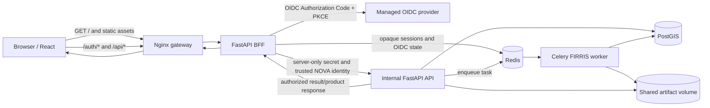

# NOVA Staging Architecture

## Request and execution topology

## Trust boundaries

- React is a public client. It contains no OIDC provider token, client secret, or `X-Internal-Secret`.
- Nginx terminates the browser origin and routes authentication and API requests to the BFF. It does not implement authentication.
- The BFF owns OIDC validation, Redis-backed opaque sessions, CSRF validation, membership revalidation, and trusted internal request headers.
- The API owns organization/project authorization, engine entitlements, task/result persistence, and protected product delivery.
- Redis is both the BFF session/state store and Celery transport/backend, using configured namespaces/databases.
- PostGIS persists identity, membership, project, AOI, task, and result records.
- API and worker mount the same artifact volume. Nginx and the BFF do not mount it.

## Health visibility

| Component | Check |
|---|---|
| Gateway | `GET /healthz` |
| React assets | `GET /healthz/frontend`, which must resolve the built `index.html` |
| BFF | `GET /healthz/bff` through Nginx and internal `/health` container check |
| API | Container `/health` check plus an internal request from `check_staging_health.py` |
| Worker | Artifact-storage validation plus Celery `inspect ping` |
| Redis | `redis-cli ping` |
| PostGIS | `pg_isready` using the container database identity |
| Nginx | Container health plus `nginx -t` |

`scripts/check_staging_health.py` aggregates these checks without printing environment secrets.

## Error-handling boundary

- The browser renders the stable public error envelope and never a server traceback.
- A protected request returning `401` clears organization-scoped cached data and revalidates the session.
- Client errors are not automatically retried; transient server/network errors use bounded query retry behavior.
- Unsafe methods receive the in-memory `X-CSRF-Token`; it is not written to browser storage.
- Task pages render only `error_summary`.
- Protected downloads use the same-origin result-product endpoint, not a storage path supplied to the browser.
